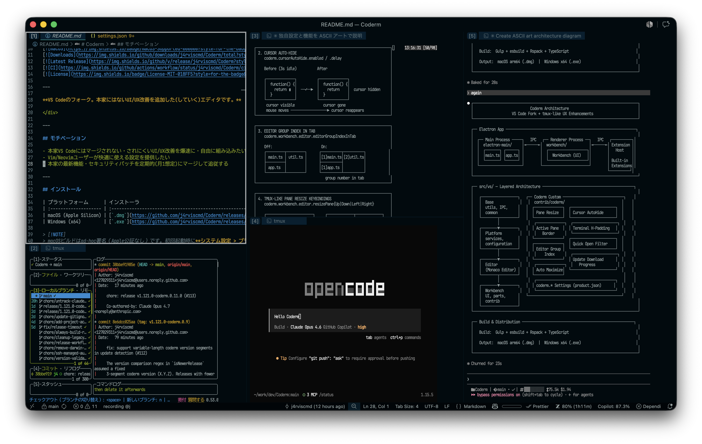

<!-- markdownlint-disable MD036 -->
<div align="center">

# Coderm



[日本語](README.ja.md) | English

[](https://github.com/j4rviscmd/Coderm/releases/latest/download/CodermSetup-x64.exe)
[](https://github.com/j4rviscmd/Coderm/releases/latest/download/Coderm-arm64.dmg)
[](https://github.com/j4rviscmd/Coderm/releases/latest)<br/>
[](https://github.com/j4rviscmd/Coderm/releases/latest)
[](https://github.com/j4rviscmd/Coderm/actions)
[](LICENSE.txt)

---

**Coderm = VS Code + Terminal**

A highly customized fork of VS Code optimized for Vim/Neovim users, prioritizing custom optimizations over upstream synchronization.

</div>

---

## Motivation

- Prioritize custom optimizations and performance improvements tailored for terminal-focused workflows
- Provide settings and keybindings optimized for Vim/Neovim users
- Upstream is not regularly merged; individual features/patches are considered on-demand via custom implementation

---

## Installation

| Platform              | Installer                                                                                  |
| :-------------------- | :----------------------------------------------------------------------------------------- |
| macOS (Apple Silicon) | [`.dmg`](https://github.com/j4rviscmd/Coderm/releases/latest/download/Coderm-arm64.dmg)    |
| Windows (x64)         | [`.exe`](https://github.com/j4rviscmd/Coderm/releases/latest/download/CodermSetup-x64.exe) |

> [!NOTE]
> macOS builds use ad-hoc code signing (not Apple-notarized). On first launch, go to **System Settings > Privacy & Security** and click **Open Anyway**. Alternatively, run:
>
> ```sh
> xattr -dr com.apple.quarantine "/Applications/Coderm.app"
> ```

---

## Coderm-Specific Settings

Settings unique to Coderm that are not available in upstream VS Code.

| Setting                                          | Type       | Default                                          | Description                                         |
| :----------------------------------------------- | :--------- | :----------------------------------------------- | :-------------------------------------------------- |
| `coderm.activePaneBorder.enabled`                | `boolean`  | `true`                                           | Enable active pane border highlight                 |
| `coderm.activePaneBorder.color`                  | `string`   | `""`                                             | Border color (empty = theme's `focusBorder`)        |
| `coderm.activePaneBorder.width`                  | `number`   | `1`                                              | Border thickness (px, 1–5)                          |
| `coderm.activePaneBorder.radius`                 | `number`   | `5`                                              | Corner radius (px, 0–20; 0 = square corners)        |
| `coderm.cursorAutoHide.enabled`                  | `boolean`  | `true`                                           | Auto-hide mouse cursor after inactivity             |
| `coderm.cursorAutoHide.delay`                    | `number`   | `3000`                                           | Delay before hiding cursor (ms)                     |
| `coderm.cursorAutoHide.suppressHover`            | `boolean`  | `true`                                           | Suppress editor hover when cursor is auto-hidden    |
| `coderm.workbench.editor.editorGroupIndexInTab`  | `boolean`  | `false`                                          | Show editor group index `[N]` in tab                |
| `coderm.workbench.editor.autoMaximizeOnFocus`    | `boolean`  | `true`                                           | Control auto-maximize when focusing smallest pane   |
| `coderm.workbench.editor.preventNewGroupOnFocus` | `boolean`  | `false`                                          | Prevent creating new editor group on focus          |
| `coderm.workbench.editor.resizeIncrement`        | `number`   | `60`                                             | Pane resize increment (px)                          |
| `coderm.terminal.horizontalPadding`              | `number`   | `20`                                             | Terminal horizontal padding (px, 0–100)             |
| `coderm.quickOpen.includeTerminals`              | `boolean`  | `true`                                           | Include terminal editors in Quick Open              |
| `coderm.quickOpen.localFiles`                    | `boolean`  | `true`                                           | Include local files with absolute paths in Quick Open when connected via SSH |
| `coderm.updateDownloadProgress.enabled`          | `boolean`  | `true`                                           | Show progress notification during update download   |
| `coderm.terminal.closeEmptyPaneOnKill`           | `boolean`  | `true`                                           | Close empty pane and restore focus on terminal kill |
| `coderm.terminal.persistSessionOnReload`         | `boolean`  | `true`                                           | Fully restore terminal sessions (process, cwd, scrollback, pane layout) on reload even when `enablePersistentSessions` is off; close/quit still discards |
| `coderm.titleBar.hideMoreActions`                | `boolean`  | `true`                                           | Hide the trailing "More Actions" overflow button (`...`) in the title bar |
| `coderm.inactiveOverlay.mode`                    | `string`   | `"on"`                                           | Inactive-window overlay mode (`on` / `off` / `blur-off`)                |
| `coderm.inactiveOverlay.delay`                   | `number`   | `300`                                            | Delay before showing overlay when inactive (ms, 0–5000)                 |
| `coderm.inactiveOverlay.label`                   | `boolean`  | `true`                                           | Show the centered "Not Active" card on the overlay                       |
| `coderm.inactiveOverlay.dimming`                 | `number`   | `0.45`                                           | Backdrop darkness of the overlay (0–1; applies to both `on`/`blur-off`)  |
| `coderm.modal.captureContent`                    | `boolean`  | `true`                                           | When a modal editor is open, route Quick Open / terminal editors into it instead of closing the modal (off = upstream behavior) |
| `coderm.workbench.editor.separateTerminalEditors` | `boolean`  | `true`                                           | Never mix terminal and text editors in one group; Quick Open and other default open paths route to an existing same-type group (or a new one) instead of mixing |
| `coderm.workbench.editor.singleTerminalEditorPerGroup` | `boolean`  | `true`                                           | Limit each editor group to a single terminal editor; opening a new terminal routes to an empty group (or creates one) instead of adding a tab to an existing terminal group |
| `coderm.workbench.editor.disableGroupLock`        | `boolean`  | `true`                                           | Completely disable the editor group lock feature — groups can never be locked (automatically or manually) and always behave as unlocked |
| `coderm.languageHost.enabled`                    | `boolean`  | `false`                                          | _(experimental)_ Enable the native (Rust) Language Host. Provides tree-sitter-backed documentSymbol, foldingRange, hover, definition, references, and document highlights for the configured languages (Phase 5) |
| `coderm.languageHost.languages`                  | `array`    | `[]`                                             | _(experimental)_ Language IDs handled by the native host (e.g. "typescript", "tsx"). Empty keeps the feature inert |

---

## Coderm-Specific Commands

| Command                                   | Description           |
| :---------------------------------------- | :-------------------- |
| `coderm.workbench.editor.resizePaneUp`    | Resize pane upward    |
| `coderm.workbench.editor.resizePaneDown`  | Resize pane downward  |
| `coderm.workbench.editor.resizePaneLeft`  | Resize pane leftward  |
| `coderm.workbench.editor.resizePaneRight` | Resize pane rightward |
| `coderm.workbench.modalEditor.open`       | Open modal editor      |
| `coderm.workbench.modalEditor.close`      | Close modal editor     |
| `coderm.workbench.openReadme`             | Open the workspace root's README.md, or create a new untitled file if absent |

> [!TIP]
> **Modal Editor:** While a modal is open and focused, files from Quick Open and editor-targeted terminals open directly inside it. To run a terminal (e.g. `lazygit`) inside the modal, set `terminal.integrated.defaultLocation: "editor"` — panel terminals do not flow into the modal. Set `coderm.modal.captureContent: false` to restore the upstream behavior (closing the modal and redirecting editors to the main area).

> [!TIP]
> **[psmux](https://github.com/psmux/psmux) users:** Set `terminal.integrated.enableWin32InputMode: true` so that psmux and similar terminal multiplexers can correctly distinguish modified key events (e.g., Ctrl+J) in the integrated terminal.

---

## Known Limitations

| Feature                              | Limitation                                    | Notes                                                                                                   |
| :----------------------------------- | :-------------------------------------------- | :------------------------------------------------------------------------------------------------------ |
| Settings Sync                        | Unavailable (exclusive to official VS Code)   |                                                                                                         |
| `ms-python.vscode-pylance`           | Blocked (depends on proprietary module)       | Use [BasedPyright](https://marketplace.visualstudio.com/items?itemName=detachhead.basedpyright) instead |
| `ms-vscode-remote.remote-ssh`        | Blocked (depends on proprietary server infra) | Use the built-in `Open Remote - SSH` instead                                                            |
| `ms-vscode-remote.remote-ssh-edit`   | Same as above                                 |                                                                                                         |
| `ms-vscode.remote-explorer`          | Same as above                                 |                                                                                                         |
| `ms-vscode-remote.remote-containers` | Same as above                                 |                                                                                                         |
| `ms-vscode-remote.remote-wsl`        | Same as above                                 |                                                                                                         |
| `ms-vscode.remote-tunnels`           | Same as above                                 |                                                                                                         |

---

## License

MIT License — see [LICENSE.txt](LICENSE.txt).
